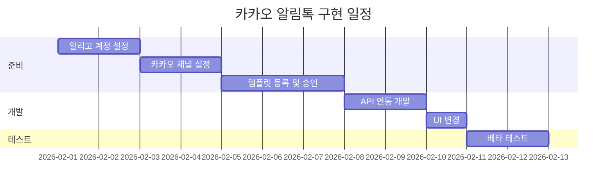
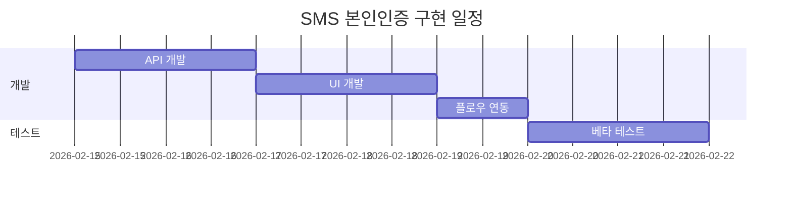
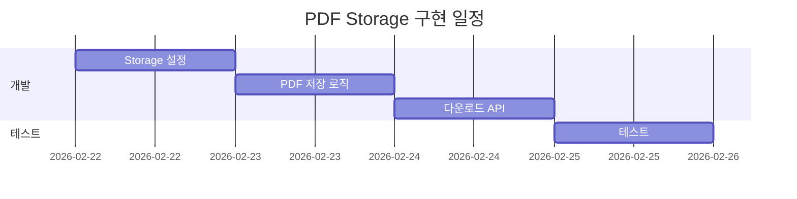

# ✅ 사업자등록 후 체크리스트

> **버전**: 1.0  
> **작성일**: 2026년 1월 25일  
> **목적**: 사업자등록 완료 후 구현해야 할 기능들의 준비 사항 및 순서 정리

---

## 📋 사전 준비 체크리스트

### 1단계: 사업자등록 완료 후 즉시

| 순서 | 작업 | 필요 서류/정보 | 예상 소요 |
|------|------|---------------|----------|
| 1.1 | 사업자등록증 스캔본 준비 | 사업자등록증 원본 | - |
| 1.2 | 대표자 신분증 사본 준비 | 주민등록증 또는 운전면허증 | - |
| 1.3 | 사업용 통장 개설 | 사업자등록증 | 1일 |

### 2단계: 알리고 계정 설정

| 순서 | 작업 | 필요 정보 | 예상 소요 |
|------|------|----------|----------|
| 2.1 | 알리고 회원가입 | 사업자등록증, 대표자 정보 | 10분 |
| 2.2 | 사업자 인증 | 사업자등록증 업로드 | 1-2일 (심사) |
| 2.3 | API Key 발급 | 계정 승인 후 | 즉시 |
| 2.4 | 발신번호 등록 | 통신서비스이용증명원 또는 전화요금 납부서 | 1-2일 |
| 2.5 | 포인트 충전 | 결제수단 등록 | 즉시 |

### 3단계: 카카오 비즈니스 채널 설정

| 순서 | 작업 | 필요 정보 | 예상 소요 |
|------|------|----------|----------|
| 3.1 | 카카오 비즈니스 계정 생성 | 카카오 계정 | 10분 |
| 3.2 | 채널 생성 | 채널명, 프로필 이미지 | 30분 |
| 3.3 | 사업자 인증 | 사업자등록증 | 1-2일 (심사) |
| 3.4 | 알림톡 발송 권한 신청 | 사업자 인증 완료 후 | 1-2일 |
| 3.5 | 알리고와 연동 (발신 프로필 등록) | 채널 ID, API Key | 30분 |

### 4단계: 알림톡 템플릿 등록

| 순서 | 작업 | 필요 정보 | 예상 소요 |
|------|------|----------|----------|
| 4.1 | 템플릿 작성 (계약서 전송 알림) | 메시지 내용, 버튼 정보 | 1시간 |
| 4.2 | 카카오 검수 제출 | 템플릿 코드 | 2-3일 (심사) |
| 4.3 | 수정 요청 대응 (필요시) | - | 1-2일 |
| 4.4 | 최종 승인 확인 | - | - |

---

## 🔧 환경 변수 설정

사업자등록 후 `.env.local`에 추가해야 할 변수들:

```bash
# ========================================
# 알리고 (Aligo) - 알림톡 & SMS
# ========================================

# 알리고 API 정보
ALIGO_API_KEY=your_aligo_api_key
ALIGO_USER_ID=your_aligo_user_id

# 알리고 발신프로필 키 (카카오 채널 연동 후)
ALIGO_SENDER_KEY=your_sender_key

# 발신 전화번호 (알리고에 등록된 번호)
SENDER_PHONE_NUMBER=010-xxxx-xxxx

# ========================================
# 카카오 비즈니스 채널
# ========================================

# 카카오 채널 ID (pfId)
KAKAO_CHANNEL_ID=@signplease

# ========================================
# SMS 인증 관련
# ========================================

# SMS 인증번호 해시 솔트
SMS_CODE_SALT=generate-random-32-byte-string

# ========================================
# 주민번호 해시 솔트 (선택)
# ========================================

SSN_HASH_SALT=your-ssn-hash-salt
```

---

## 📊 구현 순서 로드맵

### Phase 1: 카카오 알림톡 (1순위) - 예상 1-2주



**산출물**:
- [ ] `lib/aligo/client.ts` - 알리고 API 클라이언트
- [ ] `app/api/alimtalk/send/route.ts` - 알림톡 발송 API
- [ ] `notification_logs` 테이블 마이그레이션
- [ ] UI 변경 (전송 버튼, 성공/실패 알림)

### Phase 2: SMS 본인인증 (2순위) - 예상 1주



**산출물**:
- [ ] `lib/aligo/sms.ts` - SMS 발송 클라이언트
- [ ] `app/api/sms/send-code/route.ts` - 인증번호 발송 API
- [ ] `app/api/sms/verify-code/route.ts` - 인증번호 검증 API
- [ ] `sms_verifications` 테이블 마이그레이션
- [ ] `app/(public)/auth/verify-phone/page.tsx` - 인증 UI

### Phase 3: PDF Storage (3순위) - 예상 3-4일



**산출물**:
- [ ] `contracts-pdf` Storage 버킷 설정
- [ ] `lib/pdf/generateAndSave.ts` - PDF 생성 및 저장
- [ ] `app/api/pdf/download/[contractId]/route.ts` - 다운로드 API
- [ ] `signatures` 테이블 감사 필드 추가

---

## 💰 비용 요약

### 초기 비용 (없음)
- 알리고 가입: 무료
- 카카오 채널 생성: 무료

### 월간 운영 비용 (예상)

| 항목 | 단가 | 예상 사용량 | 월 비용 |
|------|------|------------|--------|
| 알림톡 | 약 8원/건 | 1,000건 | 8,000원 |
| SMS (Fallback) | 약 15원/건 | 100건 | 1,500원 |
| SMS 인증 | 약 18원/건 | 600건 | 10,800원 |
| **총합** | | | **약 20,300원/월** |

### Storage 비용
- Supabase Pro 기본 제공 8GB 내에서 충분
- 5년 후 예상: 약 30GB → 월 $0.46 추가

---

## 🔒 보안 체크리스트

### 환경 변수 보안
- [ ] 모든 API Key는 서버 사이드에서만 사용
- [ ] NEXT_PUBLIC_ 접두사 없이 설정
- [ ] Vercel 환경 변수에 등록

### 인증 보안
- [ ] SMS 인증번호 해시 저장
- [ ] Rate Limiting 구현
- [ ] 발송 로그 저장

### 데이터 보안
- [ ] PDF는 private 버킷에 저장
- [ ] Signed URL로만 접근 가능
- [ ] 5년 후 자동 삭제 정책

---

## 📞 긴급 연락처

### 알리고 고객센터
- 전화: 1544-8572
- 운영시간: 평일 09:00~18:00

### 카카오 비즈니스 센터
- URL: https://business.kakao.com
- 고객센터: 카카오톡 채널 "카카오비즈니스"

---

## ⚠️ 주의사항

### 알림톡 템플릿 주의점
1. **광고성 문구 금지**: "할인", "프로모션" 등 광고성 문구 포함 시 반려
2. **변수 형식 준수**: `#{변수명}` 형식 사용
3. **버튼 URL 검증**: 실제 동작하는 URL이어야 함
4. **검수 기간**: 영업일 기준 2-3일 소요

### 발신번호 등록 주의점
1. **통신사 증명 필요**: 통신서비스이용증명원 또는 전화요금 납부서
2. **사업자 명의 일치**: 발신번호 소유자와 사업자 명의 일치 필요
3. **등록 심사**: 1-2일 소요

### SMS 비용 관리
1. **스팸 방지**: Rate Limiting 필수
2. **재발송 제한**: 악용 방지를 위한 제한 설정
3. **비용 모니터링**: 알리고 대시보드에서 정기 확인

---

## 📄 관련 문서

| 문서 | 경로 | 설명 |
|------|------|------|
| 카카오 알림톡 스펙 | `docs/SPEC_KAKAO_ALIMTALK.md` | 알림톡 상세 구현 스펙 |
| SMS 본인인증 스펙 | `docs/SPEC_SMS_AUTH.md` | SMS 인증 상세 구현 스펙 |
| PDF Storage 스펙 | `docs/SPEC_PDF_STORAGE.md` | PDF 저장 상세 구현 스펙 |
| 인터뷰 Q&A | `docs/INTERVIEW_QA.md` | 요구사항 수집 인터뷰 기록 |

---

> **마지막 업데이트**: 2026년 1월 25일
